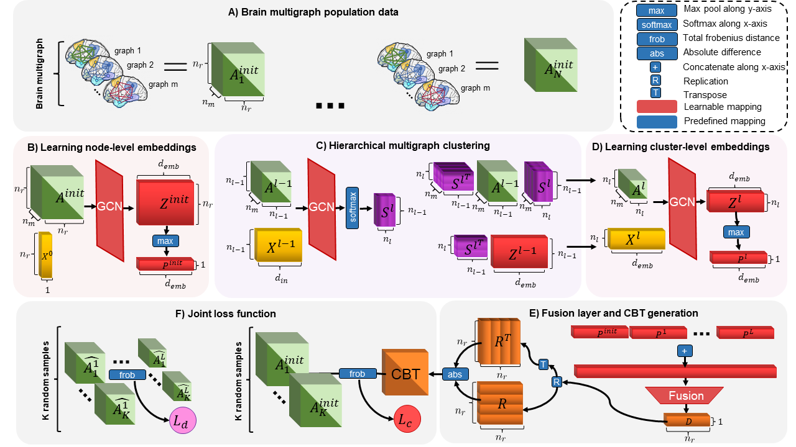
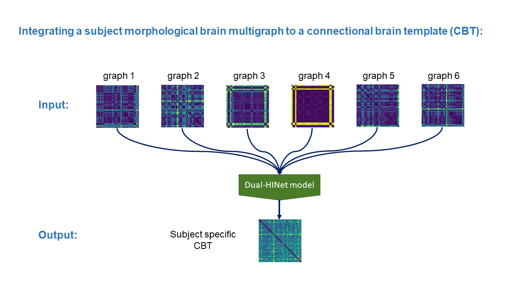

# Dual-HINet: Dual Hierarchical Integration Network (Dual-HINet)

How to capture modualrity and integrate a set of multigraphs into a single graph?

Please contact fatihdedi18@gmail.com for inquiries. Thanks. 



# Introduction
This work is accepted at the MICCAI 2022 conference, Singapore.

> **Dual Hierarchical Integration Network: Dual Hierarchical Integration
Network of Multigraphs for Connectional Brain
Template Learning**
>
> Fatih Said Duran, Abdurrahman Beyaz and Islem Rekik
>
> BASIRA Lab, Faculty of Computer and Informatics, Istanbul Technical University, Istanbul, Turkey
>
> **Abstract:** *A connectional brain template (CBT) is a normalized representation of a population of brain multigraphs, where two anatomical regions of interests (ROIs) are connected by multiple edges. Each
edge captures a particular type of interaction between pairs of ROIs (e.g., structural/functional). Learning a well-centered and representative CBT of a particular brain multigraph population (e.g., healthy
or atypical) is a means of modeling complex and varying ROI interactions in a holistic manner. Existing methods generate CBTs by locally integrating heterogeneous multi-edge attributes (e.g., weights and
features). However, such methods are agnostic to brain network modularity as they ignore the hierarchical structure of neural interactions.
Furthermore, they only perform node-level integration at the individual level without learning the multigraph representation at the group
level in a layer-wise manner. To address these limitations, we propose Dual Hierarchical Integration Network (Dual-HINet) for connectional
brain template estimation, which simultaneously learns the node-level and cluster-level integration processes using a dual graph neural network architecture. We also propose a novel loss objective to jointly learn
the clustering assignment across different edge types and the centered CBT representation of the population multigraphs. Our Dual-HINet significantly outperforms state-of-the-art methods for learning CBTs on a
large-scale multigraph connectomic datasets.*


## Code
This code was implemented using Python 3.8 (Anaconda) on Windows 10.
```diff
 You can edit config.py file to configure our Dual-HINet method according to your needs.
```

## Installation
### *Anaconda Installattion*
* Go to  https://www.anaconda.com/products/individual
* Download version for your system (We used Python 3.8  on 64bit Windows 10)
* Install the platform
* Create a conda environment by typing:  ```conda create –n DualHINet pip python=3.8 ```

### *Dependency Installattion*
Copy and paste following commands to install all packages (CPU version)
```sh
$ conda activate DualHINet
$ conda install pytorch==1.4.0 torchvision==0.5.0 cpuonly -c pytorch
$ pip install scikit-learn
$ pip install matplotlib
$ pip install torch-scatter==latest+cpu -f https://pytorch-geometric.com/whl/torch-1.4.0.html
$ pip install torch-sparse==latest+cpu -f https://pytorch-geometric.com/whl/torch-1.4.0.html
$ pip install torch-cluster==latest+cpu -f https://pytorch-geometric.com/whl/torch-1.4.0.html
$ pip install torch-spline-conv==latest+cpu -f https://pytorch-geometric.com/whl/torch-1.4.0.html
$ pip install torch-geometric
```
This is all for CPU installation, please visit (optional) PyTorch-Geometric’s web page (https://pytorch-geometric.readthedocs.io/en/latest/notes/installation.html) for description on installing GPU version. Code will check the version of dependencies and availability of GPU. If everything is configured correctly, it will utilize GPU automatically.

## Data format
In case you want to use Dual-HINet on your multi-graphs, we represent each brain multi-graph with a stacked symmetrical connectivity matrices. Therefore our model expects you to provide a path of M array saved as a binary file in MAT .mat format with shape [#Subjects, #Nodes, #Nodes, #Views]. For our case network nodes were regions of interest in the brain, however, any type of node is a valid input. If your networks are single graph, you can simply set #Views to 1. Also, you can run DualHInet on a simulated dataset by setting ```Dataset = 'S' ``` at config.py file.  

## Run Dual-HINet
To run our code, open up a terminal at Dual-HINet’s directory and type in
```sh
$ conda activate DualHINet & python demo.py
```
#####  You may edit config.py to tune hyperparameters, configure training or supply your own dataset.

## Components of DualHINet’s Code
| Component                   | Content                                                                                                         |
|-----------------------------|-----------------------------------------------------------------------------------------------------------------|
| config.py                   | Includes hyperparameter and other options. You may modify it according to your needs.                           |
| GNN.py                      | Graph Neural Network part of the model.                                                                         |
| Dual_HINet.py               | Driver code that import variables from config.py and trains Dual-HINet (cross-validation).                      |
| helper.py                   | Includes some helper functions                                                                                  |
| cbts and model params/      | Includes model parameters and the estimated CBTs  for the datasets used on the paper.                           |
| simulated dataset/example.py | A simulated dataset that shows the required data format.                                                        |
| res/"model name"/            | After the training, this directory includes model parameters, final CBT, and subject biased CBTs for each fold. |
| temp/                       | Includes interim model parameters that are saved for each 10 epoch. Deleted after the training.                 |
#####  output/<model name>/ and temp/ directories created by demo.py
  
## Example Result  

The figure demonstrates an example of output for a population of 155 ASD subjects where each subject has 6 views (each represented by 35 by 35 matrix). Our code takes in a numpy array of size [155, 35, 35, 6] and outputs a 35 by 35 matrix.


## YouTube videos to install and run the code and understand how Dual-HINet works

To install and run Dual-HINet, check the following YouTube video: 

https://www.youtube.com/watch?v=Q_hyobvxpDY

To learn about how Dual-HINet works, check the following YouTube video: 

...

## Relevant References
Fey, M. & Lenssen, J. E. Fast graph representation learning with PyTorch Geometric. In ICLR Workshop on Representation Learning on Graphs and Manifolds (2019).

Adam Paszke, Sam Gross, Soumith Chintala, Gregory Chanan, Edward Yang, Zachary DeVito, Zeming Lin, Alban Desmaison, Luca Antiga, and Adam Lerer. Automatic differentiation in pytorch. In NIPS-W, 2017.

## Dual-HINet on arXiv

...

## Please cite the following paper when using Dual-HINet
```latex
  @inproceedings{duranbeyazrekik2022,
    title={Dual-HINet: Dual Hierarchical Integration Network of Multigraphs for Connectional Brain Template Learning},
    author={Duran, Fatih Said and Beyaz, Abdurrahman and Rekik, Islem},
    booktitle={Medical Image Computing and Computer Assisted Intervention},
    year={2022},
    organization={Springer}
  }
```
